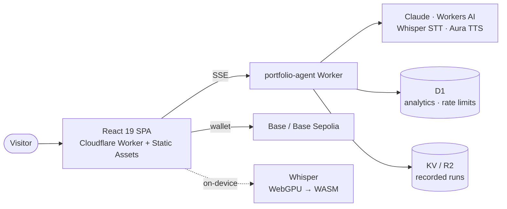

# jw3b.dev

**A portfolio you can operate, not just read.** — [**jw3b.dev →**](https://jw3b.dev)

The personal engineering site of **John Wellard** (JW3B / AgileGypsy), Senior Agentic AI
Developer & smart-contract security auditor. Most portfolios *assert* competence. This one
hands you the controls: paste a Solidity contract and watch it get screened, talk to an AI
concierge grounded in a verified evidence register, or drain a real vault on a testnet and
prove the exploit on-chain.

---

## Try it in 30 seconds

| Surface | What you can actually do |
|---|---|
| [**Home**](https://jw3b.dev) | Edit a contract in the hero console and watch the auditor re-run |
| [**/audit**](https://jw3b.dev/audit) | Paste Solidity → deterministic heuristics + an AI narrative |
| [**/ctf**](https://jw3b.dev/ctf) | Break a live reentrancy vault on Base Sepolia, verified on-chain |
| [**/work**](https://jw3b.dev/work) | Four flagship systems, each operable rather than screenshotted |
| [**/hire-me**](https://jw3b.dev/hire-me) | A 4-step engagement configurator that always ends somewhere real |
| **Concierge** | Bottom-right on every page — text or hands-free voice |

## What makes it interesting

**Everything degrades honestly.** Every live surface has a labelled fallback — a recorded run,
a book-a-call floor — so there is no dead end when a backend, a wallet, or a chain is
unavailable. That property is tested, not hoped for.

**Claims are gated, not typed.** Every number the site presents routes through an evidence
register with a source pointer; a build fails if unsourced or blocklisted copy appears. The
citable audit record is CodeHawks **#124 — 17 findings (8 High), 1,430 EXP**. There are
deliberately no TVL or "protocols secured" figures, because they can't be evidenced.

**Voice runs on-device.** The hands-free concierge transcribes with Whisper compiled to
WebGPU/WASM *in your browser* — no per-minute API cost, and your audio never leaves the
machine. It degrades WebGPU → WASM → server transcription, disclosing the switch when it
happens.

**It was built by a multi-agent pipeline.** [`mas/`](mas/) is the real engineering record:
role-scoped agents (architect, security, compliance, performance…), a task plan, phase gate
reports, and a ledger tying every task to its commit. Not a demo of agents — the actual
process that produced this repository.

## Architecture



The SPA worker owns security headers and caching (CSP on every path, immutable hashed assets,
never-cached shell). The API worker owns model routing, per-IP rate limiting, and persistence.
Heavy dependencies — wallet stack, XMTP, the ASR runtime — are code-split off the boot path so
the hero paints from prerendered HTML before any JavaScript runs.

## Quick start

```bash
npm ci                 # .npmrc pins legacy-peer-deps for the React 19 graph
npm run dev            # Vite dev server
npm test               # Vitest — unit + component suites
npm run build          # production build → dist/

# Cloudflare Worker (from workers/portfolio-agent/)
npx wrangler dev
```

The full quality gate — what CI runs, and what must be green before any deploy:

```bash
npm run lint && npm test && npm run build && npm run claims-gate && npm run secret-scan
```

`claims-gate` fails on unsourced or blocklisted claims; `secret-scan` fails if a server secret
reaches `src/` or the client bundle.

## Repository map

| Path | Contents |
|---|---|
| [`src/`](src/) | React app — components, hooks, pure logic in `src/lib/` |
| [`workers/portfolio-agent/`](workers/portfolio-agent/) | Edge API: concierge, audit, voice, CTF verification |
| [`contracts/`](contracts/) | Foundry — milestone escrow + the CTF vault, with fuzz and invariant tests |
| [`docs/`](docs/) | Runbook, ops, compliance, and the research behind it |
| [`mas/`](mas/) | The multi-agent build record: plan, role ledger, phase gate audits |
| [`design/`](design/) | Design story and creative briefs |
| [`scripts/`](scripts/) | Gate scripts (claims, secret scan) |
| [`config/`](config/) | Build tooling — Vite, Vitest, ESLint, Tailwind, PostCSS (kept out of the root) |

Pure, exhaustively-tested logic lives in `src/lib/` — audit heuristics, checkout routing, the
voice state machine, VAD maths — deliberately separated from React so it can be verified
without a DOM.

## Status, honestly

- **Live in production:** the site, AI concierge (text + voice), `/audit` console, the on-chain
  CTF, Mission Control, and the book-a-call path.
- **Testnet:** the milestone escrow is deployed and wired on Base Sepolia. It is intentionally
  **off** in the production hire flow — routing a real engagement through a testnet contract
  would be dishonest — so that path uses book-a-call until a mainnet escrow is funded.
- **Not yet provisioned:** Unlock Protocol locks (needs mainnet deployment).

Known gaps and deferred work are tracked openly in [`docs/DEFERRED.md`](docs/DEFERRED.md).

## Security

Found something? See [SECURITY.md](SECURITY.md) — responsible disclosure is welcome and
credited. The CTF vault is *intentionally* vulnerable; that's the challenge, not a bug.

## License & contact

Code is [MIT](LICENSE). Written content, branding, and John's personal record are not — see the
license note. Reach him at **john@agilegypsy.com** or via
[agilegypsy.com](https://agilegypsy.com).

---

<p align="center"><em>Stay Weitd</em> 👽</p>
