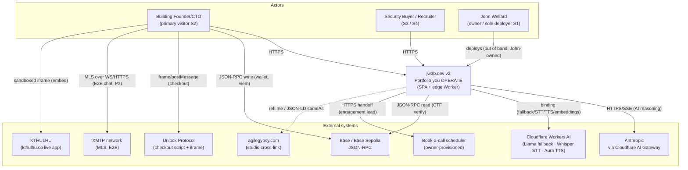
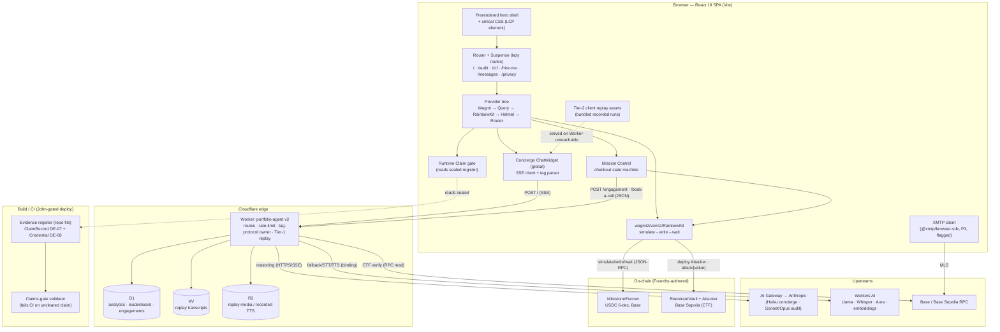
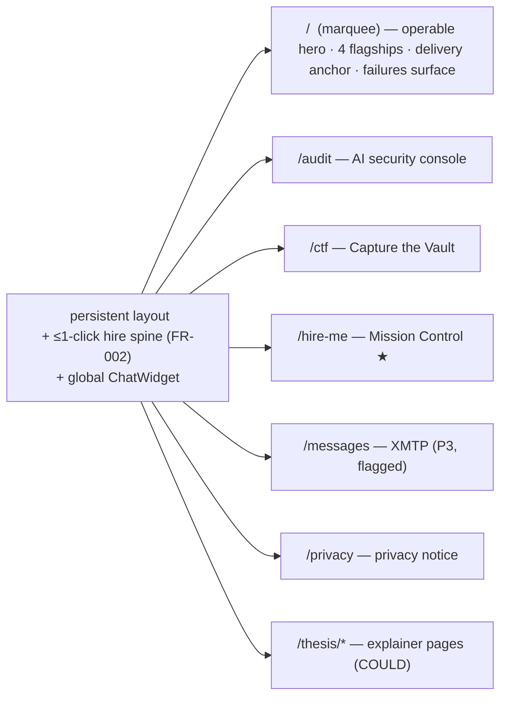
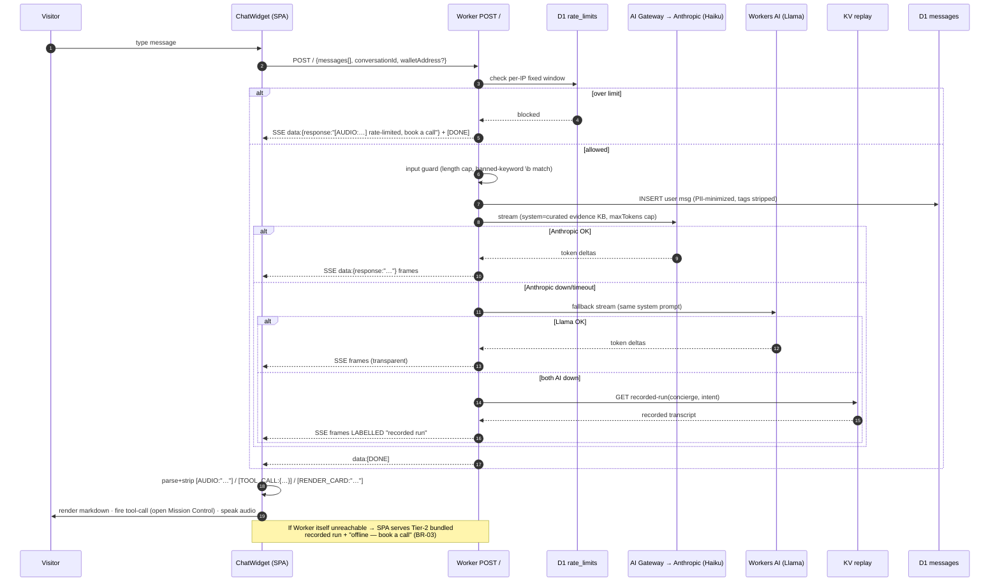
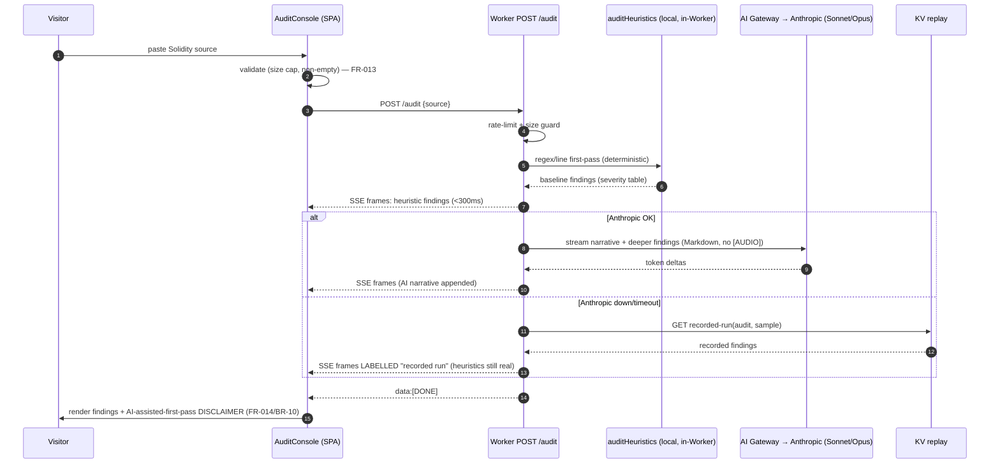
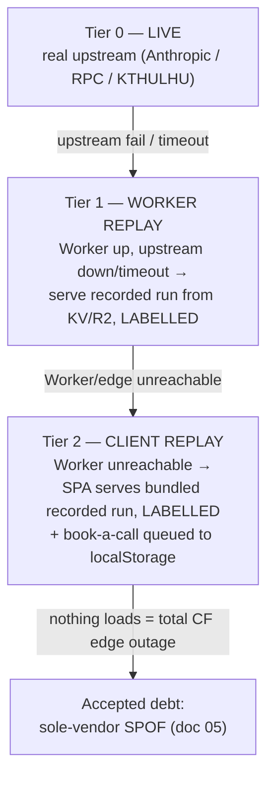
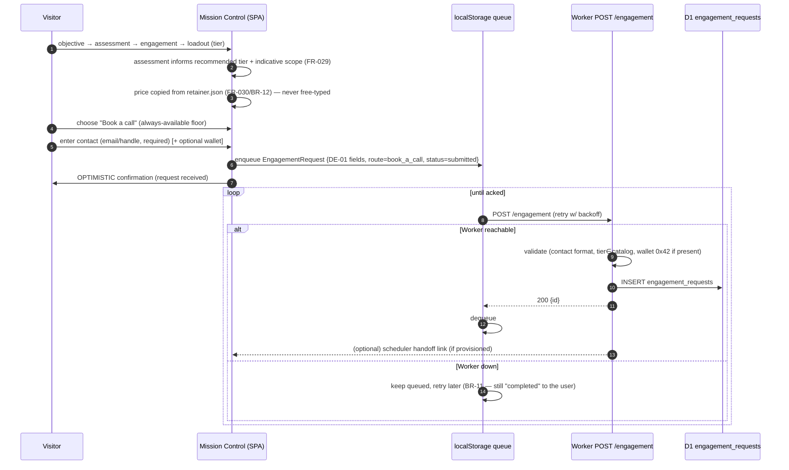
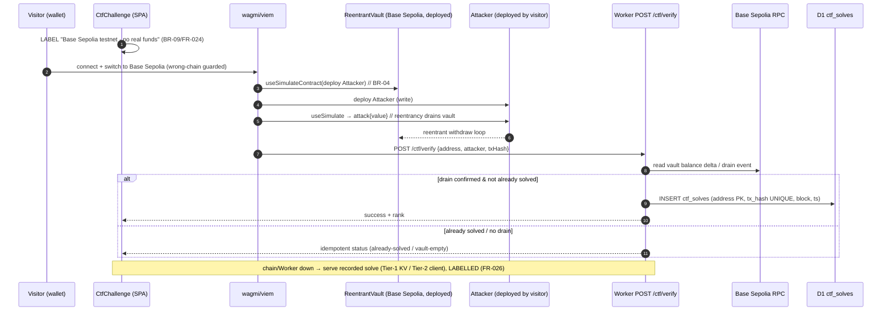
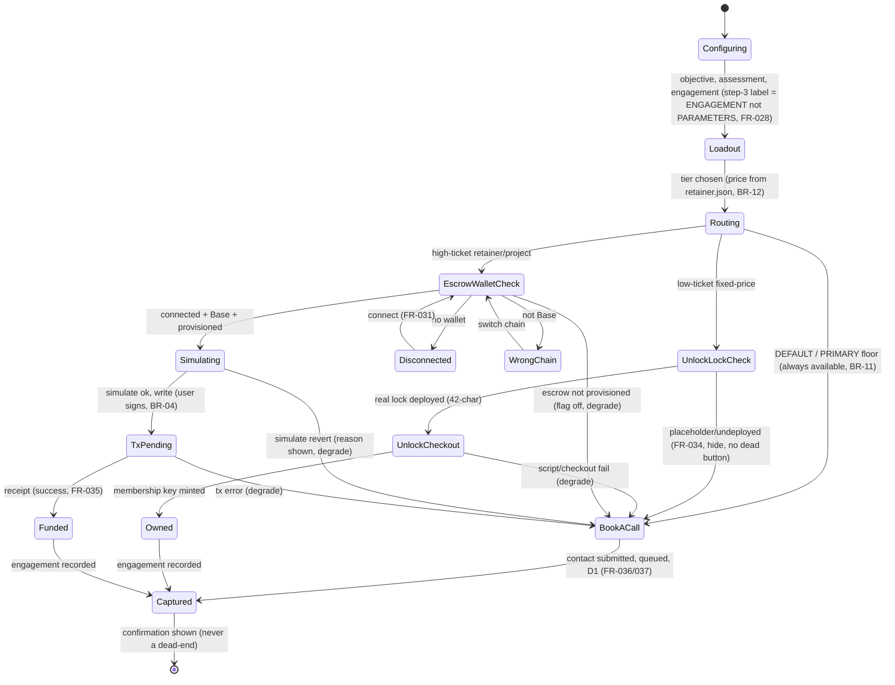
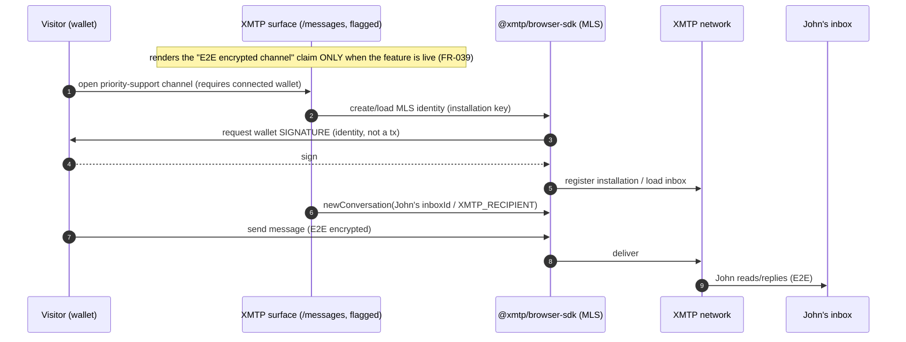

# 02 — System Context & Data Flow — jw3b.dev v2 (MAS Phase 3)

**Role:** solutions-architect · **Date:** 2026-08-16 · **Status:** DRAFT (design)
**Reads from:** doc `01` (NFR baseline). Diagrams are Mermaid, protocols annotated.

---

## 1. Architectural pattern (chosen, NFR-justified)

**Pattern: edge-serverless SPA + single edge Worker, stateless request path, D1/KV/R2 for state, with a
3-tier replay/fallback spine.** Justified by:

- **NFR-01 (LCP ≤ 2.5s, first-token ≤ 2–3s):** edge compute + SSE streaming + a prerendered hero shell.
- **NFR-02 (≥95% effective success, 0 hard-broken):** stateless Worker scales horizontally; the replay
  tiers (§7) decouple *availability* from *live upstreams* (Anthropic, RPC).
- **NFR-08 (cost bound):** one Worker, right-sized models per route, AI-Gateway + per-IP rate limits.
- **Fixed stack:** the platform *is* Cloudflare + a React SPA — the pattern is entailed, not chosen. The
  design decisions are *within* it (docs 03 ADRs).

This is **not** microservices (one deployable Worker; splitting adds ops cost with no NFR payoff at this
scale) and **not** a stateful monolith (no origin server; state lives in managed edge stores).

---

## 2. C4 Level 1 — System context



**Protocol/data notes:** all AI reasoning is **server-side via the Worker → AI Gateway** (no browser→
Anthropic; NFR-04 secrets). Wallet **writes** are client-side (viem, user-signed); the Worker only **reads**
chain state for CTF verification. Anthropic is never called directly — always through the AI Gateway
(cost/rate/observability choke point, NFR-08).

---

## 3. C4 Level 2 — Containers



**Container responsibilities**

| Container | Owns | Binding/protocol |
|---|---|---|
| **SPA** | routes, providers, ChatWidget, Mission Control state machine, wallet flows, runtime Claim gate, **Tier-2 bundled replay** | HTTPS/SSE to Worker; JSON-RPC to chain; iframe to Unlock/KTHULHU |
| **Worker** | route contracts, **server-owned tag protocol**, rate-limit, model routing, **Tier-1 replay serving**, D1/KV/R2 access | Cloudflare bindings (`AI`,`DB`,`KV`,`R2`) + secrets |
| **D1** | analytics (conversations/messages/audit_runs), CTF leaderboard, **engagement_requests**, rate_limits, escrow index | Worker binding `DB` |
| **KV** | recorded-run **transcripts** (concierge/audit/tx/CTF), read-mostly, edge-global | Worker binding |
| **R2** | recorded **media** (sample TTS audio, any recorded-run video) | Worker binding |
| **AI Gateway** | the single choke point in front of Anthropic — rate-limit, caching, cost observability | HTTPS |
| **Evidence register + gate** | the claims source of truth; **build-time** enforcement | repo file + CI |

---

## 4. Frontend route tree & provider order



- **Provider order (FIXED):** `WagmiProvider → QueryClientProvider → RainbowKitProvider →
  HelmetProvider → RouterProvider`. Routes are **lazy-loaded behind `<Suspense>`**; heavy Web3 + R3F
  chunks are code-split out of the initial bundle and mounted **after** first paint (doc 03 §6, NFR-01).
- **Design-token hookpoint:** brand-architect (P0) publishes a CSS-custom-property token layer on `:root`
  (distinct accent per NFR-09); `tailwind.config.js theme.extend` reads those variables so components use
  **semantic token classes only** (zero raw hex outside the token layer). This is the single seam the
  design track owns; the architecture just guarantees it exists before any surface renders.
- **Claims-gate runtime:** a `<Claim id="…">` component resolves from the **sealed register** and renders
  the value only if `status==='cleared'`; otherwise it renders nothing or a cleared alternative (BR-01).

---

## 5. Sequence — (a) Concierge SSE stream + tag-protocol parse + fallback



**Tag-protocol contract (server-owned, FR-052/017 — grounded in the live Worker):**
`[AUDIO: "…"]` (leading spoken summary, TTS) · `[TOOL_CALL: {json}]` (e.g. `{"action":"openModal","type":"pricing"}`)
· `[RENDER_CARD: "name"]` (e.g. `pricing_tier_card`). **SSE frame shape:** `data: {"response":"…"}\n\n`
terminated by `data: [DONE]\n\n`. The frontend parser strips tags before rendering; the **same regex
contract lives in one shared module** consumed by the widget and asserted in tests so Worker↔parser never
drift (doc 03 §3).

---

## 6. Sequence — (b) `/audit` Solidity-audit stream (heuristic-first + replay)



**Why heuristic-first matters (NFR-02):** the deterministic `auditHeuristics` pass runs **inside the
Worker with no upstream dependency**, so `/audit` returns *real* findings even when Anthropic is down — the
recorded run only stands in for the *AI narrative*, never for the whole surface. `/fuzz` and `/tx-explain`
follow the same shape (Claude primary → Workers-AI/KV fallback); `/tx-explain` decodes the tx client-side
first, so a Worker outage still shows the decoded calldata.

---

## 7. The 3-tier replay / fallback architecture (the R-01 existential mitigation)

This is the spine that makes NFR-02 (≥95% effective success, 0 hard-broken) reachable. **Every** live
surface (concierge, `/audit` tools, CTF, KTHULHU embed) implements all three tiers.



| Tier | Trigger | Where the artifact lives | Storage decision |
|---|---|---|---|
| **0 Live** | normal | upstream | — |
| **1 Worker replay** | upstream (Anthropic/RPC) down or exceeds timeout, Worker still up | **KV** (JSON/NDJSON transcripts) + **R2** (recorded TTS audio / any video) | ADR-01 (doc 03) |
| **2 Client replay** | Worker/edge unreachable from the browser | **bundled in the SPA build** (imported JSON + asset) — independent failure domain | ADR-01 |

**Labelling invariant (BR-03 + radical-honesty pillar):** a recorded run is **always** visibly labelled
"recorded run" with its capture date; it must never masquerade as live. **Book-a-call floor (BR-11):** the
engagement-capture path uses a client-side queue (localStorage) so a submission **always completes** and
retries to `POST /engagement` when connectivity returns — it depends on no wallet, no chain, and no live
Worker. This is what lets the design survive the red-team's 4-hour-outage challenge (doc 05 §red-team #4).

---

## 8. Sequence — (c) Mission Control book-a-call capture → D1 (no wallet/chain)



**No wallet, no chain, no LLM** are on this path — that is the guarantee (BR-11, NFR-02c). The scheduler
handoff (owner-provisioned) is a *bonus* on success, never a dependency.

---

## 9. Sequence — (d) On-chain escrow: simulate → write → wait (USDC 6-dec, Base)

```mermaid
sequenceDiagram
    autonumber
    participant U as Visitor (wallet)
    participant MC as Mission Control (SPA)
    participant WK as wagmi/viem hooks
    participant ESC as MilestoneEscrow (Base)
    participant K as Worker POST /engagement

    Note over MC: high-ticket route (retainer/project) → escrow-on-acceptance branch
    MC->>WK: ensure connected + chain==Base (else prompt switch)
    MC->>WK: amount = parseUnits(price, 6)  // USDC 6-dec BigInt (BR-06)
    WK->>ESC: useSimulateContract(fund, {amount})   // BR-04 GATE
    alt simulate reverts
        ESC-->>WK: revert reason
        WK-->>MC: surface revert; block write; offer book-a-call
    else simulate ok
        WK->>ESC: writeContract(fund)  // user signs
        ESC-->>WK: tx hash
        WK->>ESC: useWaitForTransactionReceipt(hash)
        ESC-->>WK: receipt (funded)
        WK-->>MC: SUCCESS state (receipt + next steps) — FR-035
        MC->>K: POST /engagement {route=escrow, status=escrow_funded, tx_hash, wallet}
        K->>K: mirror to D1 escrow index
    end
    Note over MC,ESC: escrow contract deploy/fund is OWNER-PROVISIONED →<br/>feature-flagged; until live, this branch DEGRADES to book-a-call (FR-032/034)
```

**No `writeContract` is ever reachable without a preceding successful `useSimulateContract`** — enforced as
a code-review + web3-gate invariant (BR-04, NFR-04). Testnet vs mainnet is labelled honestly on every
on-chain surface (BR-09).

---

## 10. Sequence — (e) CTF exploit → verify → leaderboard (Base Sepolia)



---

## 11. Mission Control checkout state machine (all 3 rails, book-a-call floor)



**Invariant:** every terminal path converges on `Captured` with a visible confirmation. There is **no
state** — disconnected, wrong-chain, not-provisioned, sim-revert, script-fail — that dead-ends; each
degrades to the book-a-call floor (OBJ-01: terminal dead-ends = 0).

---

## 12. Sequence — (f) XMTP MLS onboarding (P3, off the conversion critical path)



**Placement:** entirely client-side, lazy-loaded, behind a feature flag; it **never** gates book-a-call or
checkout (P3 per roadmap). Wallet signature is for MLS identity, not a payment.

---

*End 02 — context, flows, replay spine, and state machine set. Proceed to 03 (stack ADRs, route
contracts, D1 DDL, model routing, cost).*
