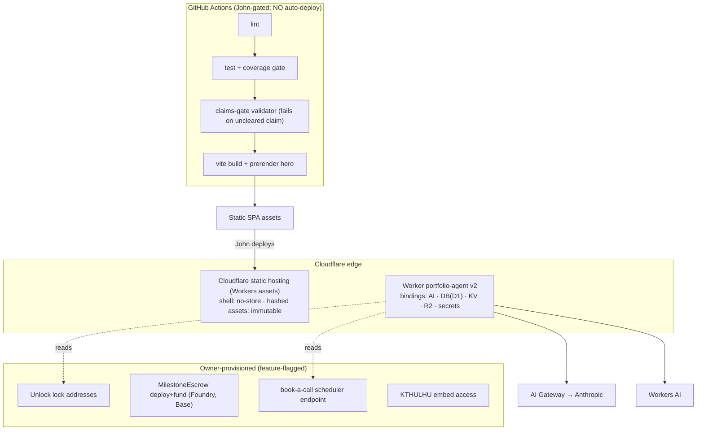

# 03 — Technology Decisions, Route Contracts & Infrastructure — jw3b.dev v2 (MAS Phase 3)

**Role:** solutions-architect · **Date:** 2026-08-16 · **Status:** DRAFT (design)

> **Platform is FIXED** (`ACTIVE_STACK.md`). No ADR re-opens React / wagmi 2 / viem 2 / RainbowKit 2 /
> Cloudflare Worker / Workers AI / D1 / Anthropic-via-Gateway / `@xmtp/browser-sdk` / Foundry. The 9 ADRs
> below decide only the **OPEN architecture choices within** that platform. Each cites the NFR it satisfies
> and gives a ≥2-option comparison. No pricing is fabricated (NFR-08 handled by mechanism; §7).

---

## 1. Confirmed platform stack (given — recorded, not re-decided)

Frontend React 19 · Vite · Tailwind 3 (token layer P0) · Framer Motion · R3F optional/budgeted. Web3
wagmi 2 · viem 2 (named imports) · RainbowKit 2 · Unlock Protocol · Base (8453) + Base Sepolia · USDC
6-dec. Backend Cloudflare Worker · Workers AI (Llama/Whisper/Aura/embeddings) · **Anthropic via AI
Gateway** · D1. Messaging `@xmtp/browser-sdk` (MLS). Contracts Foundry. Tooling Vitest/TL/jsdom · ESLint ·
`.npmrc legacy-peer-deps=true` · Buffer/global polyfill in `main.jsx`.

---

## 2. Architecture Decision Records (OPEN choices only)

### ADR-01 — Replay-artifact storage (the R-01 spine)
| | Option A: **KV (transcripts) + R2 (media)** | Option B: D1 rows | Option C: client-bundle only |
|---|---|---|---|
| Pros | edge-global low-latency reads; **independent failure domain** from D1/AI; R2 no-egress for audio/video; write-once/read-many fits curated runs | one store; SQL query | zero infra; survives full Worker loss |
| Cons | two bindings to manage | **couples the fallback to the very DB whose outage we hedge** — a shared SPOF | can't refresh without a redeploy; no per-intent variety at scale |
| NFR alignment | **NFR-02** (max failure-domain independence) | weak on NFR-02 | good Tier-2, insufficient alone |
| Monthly cost | KV/R2 within CF low tiers `[VERIFY exact tier]` | included in D1 | ~0 |
| Vendor risk | Cloudflare (already the platform) | Cloudflare | none |

**Decision: A for Tier-1, plus C as Tier-2 (layered, not either/or).** KV serves recorded transcripts,
R2 serves recorded media, **and** a curated subset is bundled into the SPA build as Tier-2. **Selected
because NFR-02** demands the fallback share as little failure domain as possible with the live path — D1
(Option B) is the wrong store precisely because it is also the live analytics/leaderboard DB.
**Risk:** replay staleness → **Mitigation:** every artifact carries a capture date, is refreshed on each
release, and is labelled "recorded run". **Trade-off accepted:** two extra bindings for a materially
stronger availability story.

### ADR-02 — Orchestration primitive
| | Option A: **stateless Worker + D1** | Option B: Durable Objects | Option C: Cloudflare Workflows |
|---|---|---|---|
| Pros | simplest; matches the live Worker; cheapest; horizontal scale for SSE | strong per-key consistency (counters, sessions, websockets) | durable multi-step w/ retries/state |
| Cons | rate-limit read-modify-write race under burst | new failure surface + cost; overkill for streaming | overkill; adds latency to request path |
| NFR alignment | **NFR-01/08** (low latency, low cost) | helps only the rate-limit edge case | helps only long provisioning jobs |
| Vendor risk | Cloudflare | Cloudflare | Cloudflare |

**Decision: A (stateless Worker + D1) for the entire request path.** **Selected because NFR-01/08** — the
concierge/audit/CTF/engagement routes are all short or streaming and need no cross-request coordination.
**DO and Workflows are explicitly deferred** with named triggers: adopt a **DO** only if D1 rate-limiting
proves racy under real abuse (see ADR-04); adopt **Workflows** only for a future durable owner-side job
(e.g. multi-step escrow provisioning) that is off the visitor path. **Trade-off accepted:** the fixed-window
race (ADR-04) in exchange for radical simplicity now.

### ADR-03 — Concierge session / state model
| | Option A: **client `conversationId` + D1 append** | Option B: DO-per-session | Option C: signed-cookie server session |
|---|---|---|---|
| Pros | matches live Worker; stateless; PII-minimized (DE-05); trivial scale | server-authoritative history | no client id management |
| Cons | client sends history each turn (token growth) | cost + complexity; not needed | cookie = consent/PII surface we'd rather avoid |
| NFR alignment | **NFR-08** (no per-session infra), **NFR-07** (less PII) | — | adds NFR-07 burden |

**Decision: A.** **Selected because NFR-08 + NFR-07** — a client-generated `conversationId` with
append-only, tag-stripped, PII-minimized message logging (analytics only) is the lightest, most
privacy-friendly model and is already the live behavior. **Risk:** unbounded history inflates token cost →
**Mitigation:** client truncates to the last N turns + Worker enforces `maxTokens`; the curated KB keeps
per-turn context small. **Trade-off accepted:** no server-side conversation resumption (not a requirement).

### ADR-04 — Rate-limiting mechanism
| | Option A: **D1 fixed-window per IP (evolve existing) + AI-Gateway ceiling** | Option B: CF native Rate-Limiting binding | Option C: DO token-bucket |
|---|---|---|---|
| Pros | already built; per-endpoint budgets easy; AI-Gateway adds a hard cost cap independent of the app | purpose-built, low overhead | precise, burst-smoothing |
| Cons | read-modify-write race at high burst | newer binding; per-key semantics to validate `[VERIFY]` | most complex; new failure surface |
| NFR alignment | **NFR-08** (bounds cost + abuse) with defense-in-depth | NFR-08 | NFR-08 |

**Decision: A (D1 fixed-window + AI-Gateway ceiling), defense-in-depth.** **Selected because NFR-08** — two
independent bounds (app-level per-IP window *and* the Gateway's own rate/cost cap in front of Anthropic)
mean neither alone is the single guard, and the Gateway backstops abuse even if the D1 window races.
**Risk:** burst race lets a few extra requests through → **Mitigation:** the Gateway cap catches spend;
promote to Option B/C if abuse is observed. **Trade-off accepted:** approximate app-level limiting, exact
spend-limiting at the Gateway.

### ADR-05 — Model routing per endpoint
| | Option A: **Anthropic-via-Gateway primary, right-sized per endpoint, Workers-AI fallback** | Option B: Workers-AI only (Llama) | Option C: Anthropic only |
|---|---|---|---|
| Pros | best reasoning where it matters (audit); cheap/fast where it doesn't (concierge); **built-in fallback** | cheapest; no external vendor | simplest routing |
| Cons | two providers to keep in sync | weaker security-analysis quality | no fallback → NFR-02 fails on Anthropic outage; higher cost |
| NFR alignment | **NFR-01/02/08** all satisfied | fails NFR-01 quality | **fails NFR-02** |

**Decision: A.** **Selected because it is the only option that satisfies NFR-01 (fast concierge), NFR-02
(fallback on outage), and NFR-08 (cost) simultaneously.** Grounded in the owner's own recent signal
("run the concierge on Haiku, reserve Opus/stronger for security analysis"). Full per-endpoint table in
§6. **Risk:** two-provider drift → **Mitigation:** one model-routing config module in the Worker; the
Workers-AI Llama path is exercised in tests. **Trade-off accepted:** mild routing complexity for
resilience + cost control.

### ADR-06 — Concierge grounding (claims-safe knowledge)
| | Option A: **curated evidence-grounded KB (from the cleared register)** | Option B: Vectorize RAG | Option C: Neon pgvector RAG (existing) |
|---|---|---|---|
| Pros | deterministic; **cannot emit an uncleared number** (KB only holds cleared claims); zero extra vendor | semantic recall over large corpus | already coded in `rag.js` |
| Cons | manual curation | retrieval can surface an ungoverned figure → BR-01 risk | **off-stack vendor (Neon)**; extra failure domain; BR-01 risk |
| NFR alignment | **NFR-08** (no vector infra), **claims BR-01/02**, NFR-02 (fewer deps) | weak on BR-01 | weak on BR-01 + adds a vendor |

**Decision: A.** **Selected because BR-01/BR-02 (claims gate)** — the concierge is a public surface that
must emit *no* uncleared or forbidden claim, and the safest guarantee is a KB generated **from the same
sealed evidence register** the UI uses, so the model literally has no ungoverned number to state. **Drop
the Neon RAG** (removes an off-stack vendor and a failure domain, helping NFR-02/08). **Risk:** less
open-domain recall → acceptable; the concierge's job is John's work, not general knowledge. **Trade-off
accepted:** curation effort for claims-safety + one fewer vendor. Vectorize reserved for a future
large-corpus need.

### ADR-07 — First-paint / LCP mechanism
| | Option A: **prerendered hero shell + inline critical CSS, hydrate + lazy live surfaces** | Option B: Worker SSR (edge-render React) | Option C: pure CSR skeleton |
|---|---|---|---|
| Pros | LCP element paints with no JS; keeps the fixed Vite-SPA model; heavy Web3/R3F code-split post-hydration | fresh server render | simplest |
| Cons | prerender step in the build | big lift on a non-Next SPA; couples first paint to Worker (hurts NFR-02) | LCP waits on JS + hydration → risks NFR-01 |
| NFR alignment | **NFR-01** (LCP ≤2.5s) + **NFR-02** (first paint independent of Worker) | hurts NFR-02 | risks NFR-01 |

**Decision: A.** **Selected because NFR-01 (LCP ≤ 2.5s) and NFR-02** — a statically prerendered hero
(headline + operable-surface skeleton) paints instantly from CDN with no dependency on the Worker, then
React hydrates and the operable widget upgrades to live; wagmi/RainbowKit/R3F are code-split out of the
initial chunk and mounted after first paint. **Caching rule (from the live repo's own hard-won lesson):**
**never edge-cache the SPA HTML shell** (`Cache-Control: no-store`/short-TTL) while hashed assets are
`immutable`-cached — avoids the stale-shell trap. **Risk:** prerender/hydration mismatch → **Mitigation:**
keep the prerendered hero static (no client-only branches in it). **Trade-off accepted:** a build-time
prerender step.

### ADR-08 — CSP for embedded live surfaces (KTHULHU embed, Unlock checkout)
| | Option A: **sandboxed iframe + strict CSP allowlist, degrade to recorded run** | Option B: server-side proxy/re-embed | Option C: recorded-run only (no live embed) |
|---|---|---|---|
| Pros | real live embed; minimal privileges; explicit allowlist | same-origin control | always works; zero embed risk |
| Cons | depends on KTHULHU allowing framing (provisioning) | heavy; security-fraught; rewrites headers | less "operable" |
| NFR alignment | **NFR-04** (CSP), NFR-02 (degrades) | fails NFR-04 spirit | safe but weaker OBJ-04 |

**Decision: A, with C as the automatic fallback.** **Selected because NFR-04** — a `sandbox`ed iframe
with a strict CSP frame-src allowlist gives KTHULHU an operable live presence at minimum privilege; if
KTHULHU can't be framed (provisioning gap), it degrades to a labelled recorded walkthrough (Tier-1/2). The
concrete CSP is in doc 04 §5. **Trade-off accepted:** the live embed is provisioning-gated; the recorded
run guarantees the surface is never broken.

### ADR-09 — Claims-gate placement
| | Option A: **build-time gate over a repo evidence register + runtime `<Claim>`** | Option B: runtime D1 gate | Option C: both authoritative |
|---|---|---|---|
| Pros | **a forbidden claim fails CI — can't ship**; register is PR-reviewable, versioned; deterministic | live-editable | belt-and-braces |
| Cons | edits need a deploy (John owns deploys anyway) | a bad row can render live before anyone reviews; couples content-safety to DB uptime | two sources of truth to reconcile |
| NFR alignment | **BR-01/02**, NFR-02 (no DB dependency for safety), OBJ-05 | weak (uptime-coupled) | redundant |

**Decision: A.** **Selected because BR-01/BR-02 + OBJ-05** — content-safety belongs at build time where CI
can **block the deploy** on any uncleared/forbidden claim, the register is reviewable in the PR, and the
guarantee doesn't depend on D1 being up. The Worker's concierge KB is **generated from the same repo
register** (ADR-06), so UI and AI share one source. D1 keeps only an optional analytics mirror. **Risk:**
CR-10-style rulings change → **Mitigation:** flipping a `status`/adding an evidence pointer is a one-line
register edit + redeploy; CR-10 clears the moment its credential URL is attached at P0. **Trade-off
accepted:** claims changes ride the deploy cycle (acceptable — John gates all deploys regardless).

---

## 3. Server-owned tag protocol (FR-052/017 — single contract, kept in sync)

- **Tags (server emits, client strips):** `[AUDIO: "…"]` · `[TOOL_CALL: {json}]` · `[RENDER_CARD: "name"]`.
- **SSE frame shape:** `data: {"response":"<delta>"}\n\n`, stream terminated by `data: [DONE]\n\n`.
  Refusals/rate-limit responses use the same frame shape so the client path is uniform.
- **Sync mechanism:** one shared TS module exports the tag regexes + a `parseTags()` used by the widget and
  the audit console; a unit test asserts the Worker's emitted examples parse cleanly — drift breaks CI.
- **Registry of tool-calls / cards** (extensible): `openModal:{pricing|contact}`, card `pricing_tier_card`
  (pricing numbers must come from `retainer.json`, BR-12). New tags require updating the shared module +
  the Worker system prompts together (documented invariant).

---

## 4. D1 schema (DDL — DE-01…08 realised)

D1 owns analytics + leaderboard + engagements + rate limits + the escrow index. **The claims register
(DE-07) and credentials (DE-08) are repo files (ADR-09), not D1 tables** — an optional read-only mirror can
be added for analytics but is not the gate.

```sql
-- Concierge analytics (DE-05) — evolve the live schema (conversations/messages).
CREATE TABLE IF NOT EXISTS conversations (
  id            TEXT PRIMARY KEY,                 -- client-generated conversationId
  wallet_address TEXT DEFAULT NULL,               -- only if the user connected; PII-minimized
  created_at    DATETIME DEFAULT CURRENT_TIMESTAMP,
  updated_at    DATETIME DEFAULT CURRENT_TIMESTAMP
);
CREATE TABLE IF NOT EXISTS messages (
  id              INTEGER PRIMARY KEY AUTOINCREMENT,
  conversation_id TEXT NOT NULL,
  role            TEXT CHECK(role IN ('user','assistant','system')) NOT NULL,
  content         TEXT NOT NULL,                  -- TAGS STRIPPED before insert
  had_audio       INTEGER NOT NULL DEFAULT 0,     -- DE-05 bool
  source          TEXT CHECK(source IN ('live','cached_replay')) DEFAULT 'live',
  created_at      DATETIME DEFAULT CURRENT_TIMESTAMP,
  FOREIGN KEY(conversation_id) REFERENCES conversations(id) ON DELETE CASCADE
);
CREATE INDEX IF NOT EXISTS idx_messages_conversation ON messages(conversation_id);

-- Audit analytics (DE-06) — no raw source retained long-term.
CREATE TABLE IF NOT EXISTS audit_runs (
  id          TEXT PRIMARY KEY,
  tool        TEXT CHECK(tool IN ('auditor','fuzz','tx_explainer')) NOT NULL,
  input_hash  TEXT,                               -- hash, not raw source (FR-013 cap enforced pre-hash)
  duration_ms INTEGER,
  source      TEXT CHECK(source IN ('live','cached_replay')) DEFAULT 'live',
  created_at  DATETIME DEFAULT CURRENT_TIMESTAMP
);

-- CTF leaderboard (DE-04) — evolve the live ctf_solves (add drained_amount).
CREATE TABLE IF NOT EXISTS ctf_solves (
  address       TEXT PRIMARY KEY,                 -- solver EOA, lowercased
  tx_hash       TEXT NOT NULL UNIQUE,             -- winning drain tx (0x + 64 hex)
  attacker      TEXT,                             -- deployed Attacker contract
  block_number  INTEGER NOT NULL,
  drained_amount TEXT,                            -- BigInt as TEXT (precision-safe)
  ts            INTEGER NOT NULL                  -- epoch seconds
);

-- Engagement capture (DE-01) — the conversion record; book-a-call floor writes here.
CREATE TABLE IF NOT EXISTS engagement_requests (
  id              TEXT PRIMARY KEY,               -- uuid
  objective       TEXT CHECK(objective IN ('security','engineering','pm')) NOT NULL,
  assessment_json TEXT,                           -- map<qId,answer> serialized
  engagement      TEXT CHECK(engagement IN ('project','retainer')) NOT NULL,
  tier            TEXT NOT NULL,                  -- must exist in retainer.json catalog
  indicative_price TEXT NOT NULL,                 -- copied from retainer.json (BR-12), never free-typed
  route           TEXT CHECK(route IN ('book_a_call','escrow','unlock')) NOT NULL,
  wallet          TEXT DEFAULT NULL,              -- 42-char 0x if present
  contact         TEXT NOT NULL,                  -- email/handle, format-validated
  tx_hash         TEXT DEFAULT NULL,              -- set when route=escrow funded
  status          TEXT CHECK(status IN ('submitted','contacted','escrow_funded','paid','closed'))
                    NOT NULL DEFAULT 'submitted',
  created_at      DATETIME DEFAULT CURRENT_TIMESTAMP
);
CREATE INDEX IF NOT EXISTS idx_engagement_status ON engagement_requests(status);
CREATE INDEX IF NOT EXISTS idx_engagement_created ON engagement_requests(created_at);

-- Escrow index (DE-03) — off-chain mirror of on-chain truth (chain is authoritative).
CREATE TABLE IF NOT EXISTS escrow_agreements (
  id              TEXT PRIMARY KEY,
  request_id      TEXT,                           -- FK → engagement_requests.id
  client_wallet   TEXT, provider_wallet TEXT,
  amount_usdc     TEXT,                           -- 6-dec BigInt as TEXT (BR-06)
  milestone       TEXT,
  state           TEXT CHECK(state IN ('funded','released','refunded')),
  contract_address TEXT,
  chain           TEXT CHECK(chain IN ('base','base_sepolia')),
  is_testnet      INTEGER NOT NULL DEFAULT 1,     -- must match chain + be shown (BR-09)
  tx_hash         TEXT,
  created_at      DATETIME DEFAULT CURRENT_TIMESTAMP
);

-- Claims register MIRROR (DE-07) — OPTIONAL, analytics/KB-generation only.
-- AUTHORITATIVE source is the repo evidence-register file (ADR-09); the build-time gate
-- reads that, not this table. This mirror exists so the concierge KB build + analytics can
-- query cleared claims in SQL. A row here NEVER authorizes rendering — the build gate does.
CREATE TABLE IF NOT EXISTS claim_records (
  claim_id        TEXT PRIMARY KEY,               -- e.g. CR-01 … CR-10, codehawks_124
  text            TEXT NOT NULL,                  -- the claim as rendered
  value           TEXT,                           -- the number/credential
  evidence_source TEXT CHECK(evidence_source IN ('portfolio_reference','cv_source','credential_url','owner_attested','none')),
  evidence_pointer TEXT,                          -- repo/product/dashboard URL or "owner-attested, <system>"
  provenance_note TEXT DEFAULT NULL,              -- "AgileGypsy Labs / EcoGraph" for CR-01/02/03/09 + EcoGraph figures (OD-05)
  status          TEXT CHECK(status IN ('cleared','requires_resolution','forbidden')) NOT NULL,
  surfaces_json   TEXT,                            -- where it may render
  updated_at      DATETIME DEFAULT CURRENT_TIMESTAMP
);
-- SEED (P0, gates all later claim rendering — FR-061): CR-01…CR-09 = cleared with evidence
-- pointers; CR-01/02/03/09 carry the "AgileGypsy Labs / EcoGraph" provenance note; CR-10
-- = cleared ONLY once its Neo4j credential-URL evidence_pointer is attached (else withheld);
-- the forbidden list (TVL/$ secured/protocols-secured/50+ audits/PMP/PRINCE2-Practitioner)
-- seeds as status='forbidden'. Concierge sessions (DE-05) are the conversations/messages
-- tables above; the CodeHawks #124 record seeds as a cleared portfolio_reference claim.

-- Rate limiting (evolve live) — add endpoint dimension for per-route budgets.
CREATE TABLE IF NOT EXISTS rate_limits (
  ip           TEXT NOT NULL,
  endpoint     TEXT NOT NULL DEFAULT 'chat',
  window_start INTEGER NOT NULL,                  -- epoch-ms window start
  count        INTEGER NOT NULL DEFAULT 0,
  PRIMARY KEY (ip, endpoint, window_start)
);
```

**Precision note (BR-06):** USDC amounts are stored as **TEXT** to preserve exact 6-decimal BigInt values;
they are parsed with `parseUnits(x, 6)` / `formatUnits` on the client and never handled as JS floats.

---

## 5. Worker route contracts (every endpoint)

Base URL centralized in `src/config/worker.js` (public, env-overridable). **All AI endpoints:** rate-limited
(ADR-04), input-validated (NFR-04), CORS locked to the site origin allowlist (doc 04). **Auth:** none of
these require user auth (public portfolio); write-safety is enforced by validation + rate-limit, not login.

| Route | Method | Request | Response | Stream? | Rate-limit | Fallback |
|---|---|---|---|---|---|---|
| `/` (concierge) | POST | `{messages[], conversationId, walletAddress?}` | SSE `data:{response}` … `[DONE]` | **SSE** | per-IP `chat` | Llama → KV Tier-1 → client Tier-2 |
| `/audit` | POST | `{source}` (size-capped) | SSE findings (heuristic + AI) | **SSE** | per-IP `audit` | heuristic-only + KV recorded narrative |
| `/fuzz` | POST | `{source}` | SSE harness (Markdown) | **SSE** | per-IP `audit` | Llama → KV recorded |
| `/tx-explain` | POST | `{txHash}` (0x+64 validated) | SSE narrative | **SSE** | per-IP `audit` | client-decoded calldata + KV recorded |
| `/speech-to-text` | POST | audio blob | `{text}` JSON | no | per-IP `stt` | disable mic (COULD feature) |
| `/text-to-speech` | POST | `{text}` | audio bytes | no | per-IP `tts` | R2 recorded audio |
| `/ctf/verify` | POST | `{address, attacker, txHash}` | `{solved, rank, reason}` JSON | no | per-IP `ctf` | KV recorded solve |
| `/ctf/leaderboard` | GET | — | `{entries[]}` JSON | no | light | KV snapshot |
| `/engagement` | POST | DE-01 body | `{id, status}` JSON | no | light | **client localStorage queue (BR-11)** |
| `/book-a-call` | POST | `{request_id?, contact, slot?}` | `{ok, scheduler_url?}` JSON | no | light | client queue; scheduler link optional |

**Validation specifics (NFR-04):** contract `source` capped (reject > cap with a specific error, FR-013);
`txHash` matches `^0x[0-9a-fA-F]{64}$`; `contact` format-validated; `wallet` (if present) is a 42-char `0x`;
concierge input length-capped + the on-topic banned-keyword `\b`-boundary guard (anti-abuse, NFR-08).

---

## 6. Model-routing policy per endpoint (NFR-01/02/08)

| Endpoint | Primary (via AI Gateway unless noted) | Fallback chain | Why (NFR) |
|---|---|---|---|
| `/` concierge | **Claude Haiku** (fast, cheap) | Workers-AI **Llama 3.1 70B** → KV Tier-1 → client Tier-2 | NFR-01c first-token ≤2s; NFR-08 cheap |
| `/audit` | **local heuristics (always)** + **Claude Sonnet/Opus** narrative | Workers-AI Llama narrative → KV recorded (heuristics still real) | NFR-01d + stronger security reasoning; NFR-02 (local floor) |
| `/fuzz` | **Claude Sonnet** (code-gen) | Workers-AI → KV recorded | quality |
| `/tx-explain` | **Claude Haiku/Sonnet** | client-decoded calldata + KV recorded | mid reasoning; resilient |
| `/speech-to-text` | Workers-AI **`@cf/openai/whisper`** | disable mic | NFR-08 native |
| `/text-to-speech` | Workers-AI **`@cf/deepgram/aura-1`** | **R2** recorded audio | NFR-08 native |
| CTF / leaderboard / engagement | **no LLM** (RPC/D1) | KV / client queue | deterministic |

Model IDs are config (`ANTHROPIC_MODEL` / `ANTHROPIC_CHAT_MODEL` vars, already present) so routing is
tunable without code change. **Every Anthropic call goes through the AI Gateway** (the cost/rate/observability
choke point).

---

## 7. Cost model (NFR-08 — mechanism-bound; dollar figures flagged, not fabricated)

**No pricing is invented.** Cost is bounded by five independent mechanisms; exact monthly $ is
`[NEEDS RESEARCH — traffic × current Cloudflare/Anthropic list prices]`.

1. **AI Gateway ceiling** — the hard backstop: rate-limit + (where supported) spend caps + caching in front
   of Anthropic. A public AI cannot be weaponized into runaway spend because the Gateway caps it
   independent of app logic.
2. **Per-IP D1 fixed-window** limits per endpoint (ADR-04).
3. **`maxTokens` caps** per endpoint (concierge already 2560; audit/fuzz sized to output).
4. **Right-sized models** — Haiku for concierge, stronger only for security analysis (ADR-05).
5. **Workers-AI native** models for STT/TTS/embeddings/fallback (no external per-call vendor).

**Cost drivers (shape, not $):** dominant = Anthropic tokens on `/audit` + concierge; secondary = Workers-AI
inference (STT/TTS/fallback); D1/KV/R2 within low tiers. **Three usage scales** expressed as request
volume (the multiplier the eventual $ applies to): **Low** ~10² AI calls/day · **Mid** ~10³/day · **High**
~10⁴/day. At each scale the *bound* holds (Gateway cap + per-IP window); only the realized $ scales, and it
is capped by the Gateway. **Action for a later phase:** research role to attach current list prices to these
three volumes.

---

## 8. Deployment topology



- **Frontend:** Vite build (+ hero prerender) → Cloudflare static hosting. **SPA shell `Cache-Control:
  no-store`** (stale-shell trap avoided), hashed assets `immutable`.
- **Worker:** `wrangler deploy` (John-run). Bindings: `AI`, `DB` (D1 `jw3b_analytics`), **new `KV`**
  (replay transcripts), **new `R2`** (replay media). Vars: AI-Gateway base URL, `CTF_VAULT_ADDRESS`,
  `CTF_RPC_URL`. Secret: `ANTHROPIC_API_KEY` via `wrangler secret put` (never in `wrangler.toml`/bundle).
- **Contracts:** Foundry → **Base Sepolia** (CTF `ReentrantVault` already at `0x4f72…C240`; escrow demo) +
  **Base mainnet** (real escrow at deal-close). **Owner-deployed/funded**; rails feature-flagged until live.
- **CI gates (do NOT deploy — John owns):** lint → coverage → **claims-gate validator** → build. The
  claims-gate in CI is what makes ADR-09 enforceable.

---

*End 03 — stack decided, contracts + DDL + routing + cost + topology set. Proceed to 04 (security &
compliance).*
