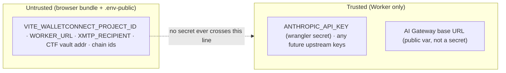

# 04 — Security & Compliance Model — jw3b.dev v2 (MAS Phase 3)

**Role:** solutions-architect · **Date:** 2026-08-16 · **Status:** DRAFT (design)
**Governs:** NFR-04 (security), NFR-07 (privacy/compliance), BR-08/09/10 (AI disclosure / testnet honesty /
audit disclaimer). MUST compliance items are implemented; the 6 open legal questions are **flagged, not
invented** (§7).

---

## 1. Trust boundaries & secrets model (NFR-04)



- **Rule:** every secret lives **only** in the Worker via `wrangler secret put`; **nothing** secret in the
  client bundle, `.env`-public, or `wrangler.toml`. `.env` holds public values only (WalletConnect project
  id, Worker URL, XMTP recipient). CI runs a **client-bundle secret-leak scan** (NFR-04) so a leaked key
  fails the build.
- **Anthropic is never called from the browser** — all reasoning is Worker→AI Gateway→Anthropic. The
  browser talks only to the Worker (SSE/JSON) and to public chains (viem RPC).
- **AI Gateway base URL is public** (it appears in Worker config) and carries no secret — the API key is the
  secret and stays server-side.

---

## 2. Identity & "auth"-adjacent flows (there is no login)

This is a public portfolio: **no username/password, no server session, no RBAC.** The only identity
primitives are **wallet connection** (for on-chain actions) and **XMTP MLS** (for E2E chat). Their
lifecycle is documented here in place of a classic auth flow.

### 2a. Wallet connection (wagmi 2 / RainbowKit 2)
```mermaid
sequenceDiagram
    autonumber
    participant U as User
    participant RK as RainbowKit connect button
    participant WC as WalletConnect / injected
    participant Chain as Base / Base Sepolia
    U->>RK: Connect
    RK->>WC: request accounts (user approves in wallet)
    WC-->>RK: address + chainId
    RK->>RK: wrong-chain? → prompt switch (guarded per surface)
    Note over RK,Chain: writes are user-SIGNED, simulate-first (BR-04). No server session is minted.<br/>"Revocation" = user disconnects; no server token to revoke.
```
- **No token TTL / refresh / server revocation** because no server session exists. Connection state is
  client-side (wagmi); disconnect clears it. Wallet address becomes data **only** if the user submits an
  engagement (then it's stored per DE-01) or connects during a concierge session (PII-minimized, DE-05).

### 2b. XMTP MLS onboarding (P3) — the E2E identity
- Wallet **signature** (not a tx) creates/loads an **MLS installation key**; the inbox is E2E-encrypted end
  to end (XMTP network can't read content). **Revocation** = revoke an MLS installation via the SDK.
  Entirely client-side; off the conversion critical path. The "E2E encrypted channel" claim renders **only
  when this feature is live** (FR-039).

---

## 3. Input validation on AI + on-chain inputs (NFR-04)

| Surface | Validation (reject with a specific error) |
|---|---|
| Concierge `/` | message length cap; on-topic **banned-keyword `\b`-boundary guard** (blocks game/ASCII/art abuse that burns tokens); history truncation |
| `/audit` `/fuzz` | Solidity **source size cap** (FR-013); non-empty; content-type |
| `/tx-explain` | `txHash` matches `^0x[0-9a-fA-F]{64}$` |
| `/engagement` | `contact` format-valid & required; `tier` ∈ retainer.json catalog; `wallet` (if present) 42-char `0x`; `indicative_price` copied from catalog, **never free-typed** (BR-12) |
| `/ctf/verify` | `address`/`attacker` are addresses; `txHash` 0x+64; solve accepted **only after on-chain drain verified** |
| On-chain writes | **`useSimulateContract` must succeed first** (BR-04); USDC as 6-dec BigInt (BR-06); testnet/mainnet labelled (BR-09) |

**Prompt-injection posture:** the concierge is grounded in the **cleared-claims KB only** (ADR-06), so even
a successful injection cannot make it state a forbidden/uncleared number; AI output is **never** trusted to
authorize an on-chain action or a price — those come from `retainer.json` and user-signed txs.

---

## 4. Rate-limiting & abuse / cost control (NFR-04, NFR-08)

Defense-in-depth (ADR-04): **per-IP D1 fixed-window** per endpoint **and** the **AI-Gateway ceiling** in
front of Anthropic (independent cost cap + caching + observability). `maxTokens` caps per endpoint;
right-sized models (Haiku concierge). Net: no single control is the only guard, and spend is capped at the
Gateway even if the app-level window races.

---

## 5. Content Security Policy (embedded live surfaces — ADR-08)

The site embeds third-party live surfaces (**Unlock checkout iframe**, **KTHULHU** embed) and loads the
**Unlock script**. Concrete CSP (served on the SPA shell; tightened from any dev `*`):

```
default-src   'self';
script-src    'self' https://paywall.unlock-protocol.com;         /* Unlock checkout script; self-host if feasible */
style-src     'self' 'unsafe-inline';                             /* Tailwind + inline critical CSS (ADR-07) */
img-src       'self' data: https:;
font-src      'self' data:;
connect-src   'self' https://<worker-host> https://sepolia.base.org https://mainnet.base.org
              https://*.walletconnect.org wss://*.walletconnect.org https://*.xmtp.network;   /* Worker + RPC + WC + XMTP */
frame-src     'self' https://*.unlock-protocol.com https://kthulhu.co;   /* checkout modal + KTHULHU embed */
frame-ancestors 'self';
base-uri      'self';
object-src    'none';
```

- **KTHULHU iframe** additionally uses `sandbox="allow-scripts allow-same-origin allow-popups"` (minimum
  privileges for an operable embed); if KTHULHU refuses framing (X-Frame-Options / no `frame-ancestors`),
  the surface **degrades to a labelled recorded run** (ADR-08 fallback).
- **Anthropic is intentionally absent from `connect-src`** — the browser never calls it directly.
- `connect-src` includes the RPC hosts viem uses for reads/writes and the XMTP/WalletConnect endpoints; keep
  this list minimal and reviewed when a dependency changes.

**CORS (Worker):** lock `Access-Control-Allow-Origin` to the **site origin allowlist** (prod domain +
preview) rather than `*`; the live Worker's permissive CORS is tightened in the rebuild (NFR-04).

---

## 6. Data handling, encryption & privacy (NFR-07)

| Data | Classification | At rest | In transit | Retention / minimization |
|---|---|---|---|---|
| Concierge messages (DE-05) | low; **PII-minimized** | D1 (Cloudflare-encrypted at rest) | TLS/HTTPS | tags stripped; no wallet/contact unless the user submits an engagement |
| Engagement requests (DE-01) | **contains PII** (contact, optional wallet) | D1 | TLS | stored to fulfil the request; covered by the privacy notice (FR-057); DSAR/erasure mechanism `[NEEDS RESEARCH]` |
| Wallet address | **potential PII** `[NEEDS RESEARCH]` | D1 (only if submitted/connected) | TLS + on-chain public | minimized; lawful-basis question flagged (§7) |
| CTF solves (DE-04) | public on-chain data | D1 | TLS | address + tx are already public |
| Audit input (DE-06) | user-supplied code | **not retained** — hashed; size-capped | TLS | `input_hash` only, never long-term raw source |
| Secrets | critical | Worker secret store | — | never in bundle/`.env`/`toml` |
| XMTP messages | **E2E encrypted** | not readable by the app or XMTP | MLS E2E | content never touches D1 |

**Encryption:** in transit = HTTPS/TLS everywhere; at rest = Cloudflare-managed D1/KV/R2 encryption. No app
passwords to hash (no login). No column-level PII crypto beyond platform encryption is proposed for launch;
if the wallet-as-PII research (§7) requires it, add it then — flagged, not silently assumed.

---

## 7. Compliance mapping (MUST duties implemented; 6 questions flagged)

**Clear duties — implemented now (do not depend on open research):**

| Requirement | Standard / basis | Implementation | Status |
|---|---|---|---|
| **AI disclosure** | BR-08, FR-021/014; EU AI Act Art. 50 (spirit) | AI-disclosure indicator on concierge + audit console; "AI-assisted first pass" on `/audit` | **IMPLEMENTED** |
| **Testnet honesty** | BR-09, FR-024/042 | "Base Sepolia · no real funds" on every CTF/testnet surface; testnet↔mainnet labelled wherever on-chain renders | **IMPLEMENTED** |
| **Audit disclaimer** | BR-10, FR-014 | disclaimer shown with every `/audit` finding set (not a substitute for a professional audit) | **IMPLEMENTED** |
| **Privacy notice** | FR-057 | `/privacy` covers analytics, connected-wallet data, engagement-request PII | **IMPLEMENTED** |
| **Claims honesty** | BR-01/02, OBJ-05 | build-time claims-gate (ADR-09); only `cleared` + sourced claims render; forbidden list blocked | **IMPLEMENTED** |
| **Secrets / data security** | NFR-04 | Worker-only secrets; bundle leak scan; input validation; rate-limit; CSP | **IMPLEMENTED** |

**Open questions — `[NEEDS RESEARCH]` (flagged to research/compliance; NOT invented here):**

| # | Question | Affects | Launch disposition |
|---|---|---|---|
| 1 | EU AI Act Art. 50 — does it apply to a portfolio concierge/`/audit`, and exact wording? | FR-021/014 | disclosure shipped; wording refined on ruling |
| 2 | Do D1 analytics require GDPR/ePrivacy or POPIA **cookie-consent**? | FR-058 | consent banner **behind a flag**, flippable on ruling |
| 3 | Is wallet address + engagement request **personal data** needing a specific lawful basis/notice? | FR-057 | privacy notice covers it now; lawful-basis text on ruling |
| 4 | Consumer-protection / refund / distance-selling on on-chain/Unlock checkout, and which jurisdiction? | FR-059 | **no paid checkout ships without terms** — terms gated behind the same provisioning flag as the rails |
| 5 | DSAR / erasure mechanism for engagement + analytics data? | FR-057 | manual process at launch; mechanism designed on ruling |
| 6 | VAT / invoicing for accepting USDC for services (VAT-registered in SA)? | ops | off-site (John's accounting); not a site feature |

**OD-04 jurisdiction (UK vs SA)** `[REQUIRES_HUMAN_INPUT]` — selects which regime *leads* the same
privacy-notice surface; non-blocking. **Compliance red-team (challenge #5)** is addressed in doc 05: clear
duties ship; the partially-addressed items are SHOULD, gated on research, and no paid checkout is reachable
without terms.

---

## 8. Backup & disaster recovery

| Asset | Backup | RPO | RTO | Runbook |
|---|---|---|---|---|
| D1 (analytics/leaderboard/**engagements**) | Cloudflare **D1 Time Travel** point-in-time restore (documented; exact window `[VERIFY]`) | ≤ Time-Travel granularity | ≤ minutes | `wrangler d1 time-travel restore` to a timestamp |
| Replay artifacts (KV/R2) | **versioned in the repo** (Tier-2 bundle is the canonical copy); KV/R2 re-seeded from repo on deploy | 0 (repo is source) | ≤ redeploy | re-run the seed step |
| Evidence register + credentials | **repo file** (ADR-09); git history | 0 | ≤ redeploy | git revert + redeploy |
| Contracts | Foundry source in repo; addresses in config | 0 | redeploy/redeploy-contract | Foundry script |
| Secrets | not backed up by design; re-issued via `wrangler secret put` | — | ≤ minutes | rotate key at provider + re-put |

**Key resilience property:** the two things whose loss would hurt most — the **conversion records**
(engagement_requests) and the **claims register** — are protected by D1 Time Travel and git respectively,
and the **book-a-call queue** buffers submissions client-side during any D1/Worker outage so no lead is lost
(BR-11).

---

*End 04 — security & compliance model set. Proceed to 05 (Master SDD: synthesis, cost, accepted debt,
decision log, red-team).*
