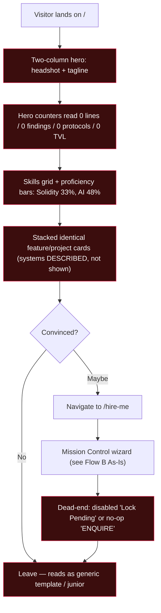
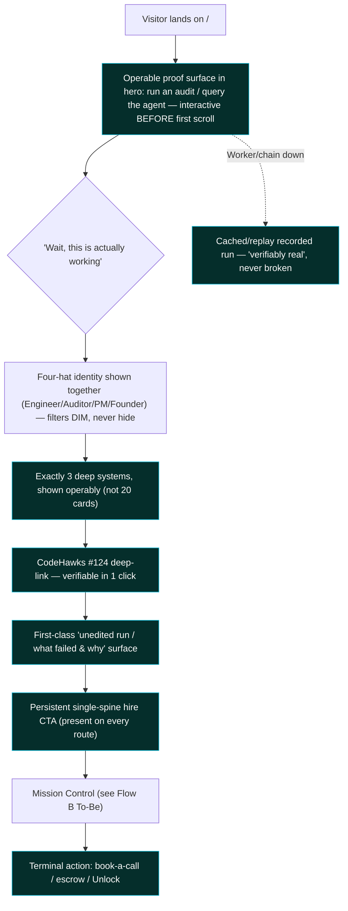
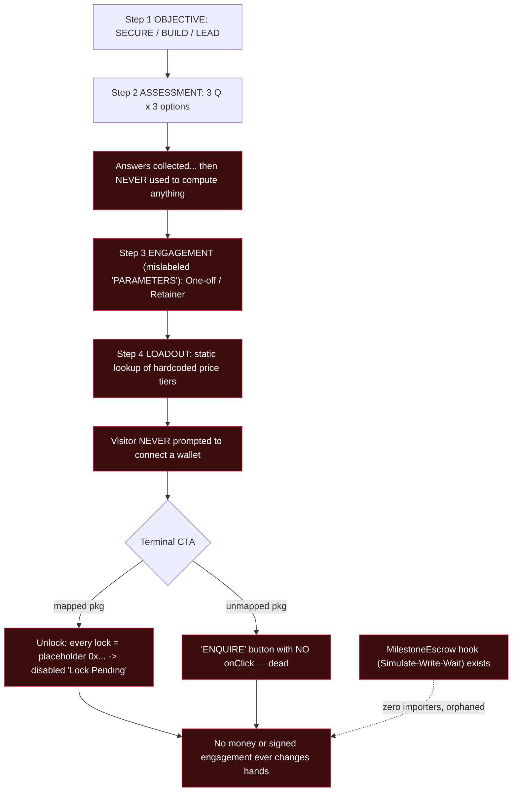
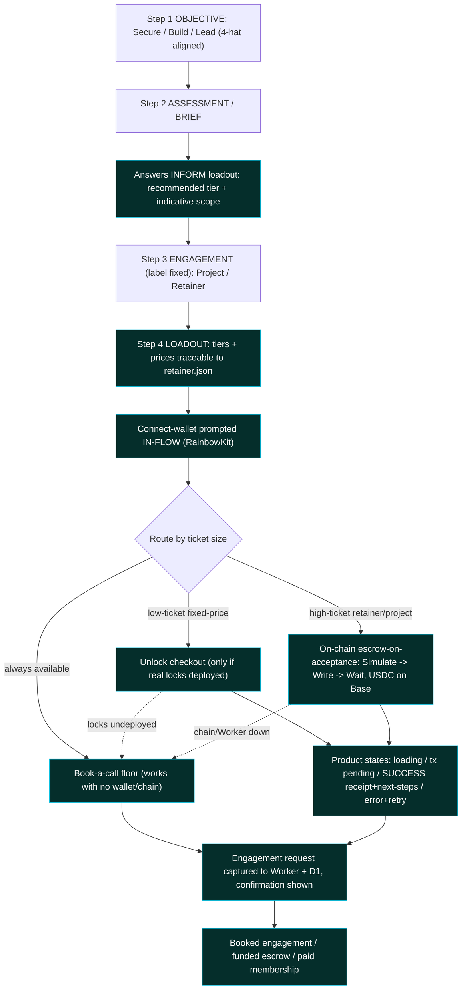

# 02 — Process Flows (As-Is → To-Be) — jw3b.dev v2

**Role:** business-analyst (MAS Phase 1) · **Date:** 2026-08-16 · **Status:** DRAFT
**Source of As-Is truth:** `mas/facts/existing-features-inventory.md` (file+line cited audit of the
current app). **To-Be honors:** the locked "operate-not-read" direction + the six must-exist features.

Two journeys are modelled: **Flow A** — the whole-site *evaluate → decide to engage* trust journey;
**Flow B** — the **Mission Control** *configure → convert* hire flow (the centerpiece the rebuild
must make actually convert). Diagrams are renderable Mermaid. Bottlenecks are marked in As-Is;
automated/repaired steps are marked in To-Be. The gap is quantified per step in §3.

> Quantification honesty: the old site has no analytics (`market_validation/04`, `05`), so As-Is
> conversion is quantified structurally (a flow that *cannot* complete = 0% completion) and by
> countable defects (dead-ends, missing states, unused steps), not by invented funnel percentages.
> To-Be conversion targets are the OBJ-01 KPIs, flagged `[ASSUMPTION — baseline]`.

---

## Flow A — Evaluate & decide to engage (whole-site trust journey)

### A · As-Is (current site — rejected as "the same scrap")

**As-Is bottlenecks (each = a Phase-0 anti-pattern):**
1. Headshot hero buries the proof ("don't make your headshot the hero" — `01/02`).
2. Counters read **`0`** — factually false and read as empty (`PORTFOLIO_REFERENCE §1b`).
3. Proficiency bars (33% Solidity) *undersell* a #124-ranked auditor (`PORTFOLIO_REFERENCE §0`).
4. Systems are prose/screenshots — nothing operable; the #1 buyer fear ("fails in production") is unanswered.
5. Verifiable record buried among 7 empty platform links.
6. `/hire-me` terminates in a dead-end → structurally 0% conversion.

### A · To-Be (operate-not-read)

**To-Be repairs (highlighted = automated/first-class):** proof replaces headshot; real numbers
replace zeros; three deep systems replace the card wall; one-click verification replaces the empty
link list; a failures surface replaces curated-only polish; a persistent spine guarantees the hire
path survives the spectacle; every live surface has a cached fallback.

---

## Flow B — Mission Control: configure → convert (THE centerpiece)

### B · As-Is (polished wizard that dead-ends — `existing-features-inventory §2–3`)

**As-Is bottlenecks:** (b1) assessment is decorative — never customizes loadout or price;
(b2) label drift "PARAMETERS" vs engagement; (b3) prices are hardcoded strings, not computed;
(b4) no wallet prompt in the entire flow; (b5) Unlock locks are all `0x...` placeholders → button
permanently disabled; (b6) unmapped packages hit a no-op dead button; (b7) the real escrow hook is
orphaned (0 importers); (b8) two disjoint payment mechanisms, neither reachable end-to-end;
(b9) advertises "E2E encrypted channel" / "XMTP priority support" that is **not built**.

### B · To-Be (a product that terminates in a real engagement)

**To-Be repairs:** the assessment now drives the recommendation; the terminal step *routes by ticket
size* to the right primitive; the wallet is connected in-flow; the full product-state set exists;
**book-a-call is the always-on floor** so conversion never depends on a wallet, a chain, real locks,
or a live Worker; every request is captured server-side and confirmed; XMTP is either built or its
claim removed. The two structural failures (dead button, orphaned escrow) are eliminated.

---

## 3. Quantified As-Is → To-Be gap table

Per-step gap in countable units (defects removed, states added, steps automated) + the conversion
delta. "Minutes saved" is not the meaningful unit for a portfolio; **dead-ends removed, missing
states supplied, and completion-rate lift are.**

| Step / capability | As-Is | To-Be | Quantified gap |
|---|---|---|---|
| **Hero first impression** | Headshot + tagline; nothing operable | Operable proof surface before first scroll | Time-to-first-proof: *never/buried* → **< 1st scroll**; operable surfaces above fold **0 → ≥1** |
| **Trust counters** | 4 counters read `0` (false) | Real record (#124 · 17 · 8 High · 1,430 EXP) or removed | False figures **4 → 0**; zero-value counters **4 → 0** |
| **Skills presentation** | Proficiency bars (33–48%) that undersell | Shipped artifacts + audit record | Underselling proficiency bars **≥5 → 0** |
| **Systems shown** | ~many stacked cards, described | Exactly 3, operable | Featured systems **>3 → 3**; operable (not screenshot) **0 → 3** |
| **Record verification** | Among 7 empty platform links | 1-click deep-link to CodeHawks | Clicks-to-verify **≫1 (sift) → ≤1**; empty links **7 → 0** |
| **Failure honesty** | None (curated only) | First-class "unedited run" surface | Failure surfaces **0 → ≥1** |
| **MC assessment (Step 2)** | Collected, **0% used** | Informs recommended tier + scope | Assessment utility **0% → drives the recommendation** |
| **MC pricing** | Hardcoded strings, unsourced | Traceable to `retainer.json` | Untraceable price claims **all → 0** |
| **MC wallet prompt** | Absent from flow | Prompted in-flow | Connect prompt **0 → 1** |
| **MC terminal action** | 2 dead-ends (disabled Unlock, no-op ENQUIRE) | book-a-call / escrow / Unlock routing | Dead-ends **2 → 0**; working terminal routes **0 → 3** |
| **MC product states** | Missing connect/loading/pending/success/error | Full set present | Missing critical states **≥5 → 0** |
| **Escrow** | Orphaned hook (0 importers) | Wired Simulate→Write→Wait in-flow | Orphaned real code **1 → 0 wired** |
| **Payment reachability** | 0 paths complete end-to-end | ≥1 always-completable (book-a-call floor) | Completable paths **0 → ≥1 guaranteed** |
| **XMTP claim** | Advertised, not built | Built OR claim removed | Unbacked feature claims **1 → 0** |
| **Live-surface resilience** | No fallback (fails = broken) | Cached/replay on every live surface | Live surfaces without fallback **all → 0** |
| **Dev scaffold** | `/test-agent` shipped | Removed | Orphan routes **1 → 0** |
| **Overall MC conversion** | **0%** (cannot complete) `[structural]` | **≥ 25%** completion `[ASSUMPTION — baseline]` | 0% → target 25% |

**Net:** the To-Be removes **≥ 7 structural defects** in Mission Control alone (b1–b9 above → 0),
supplies the missing back half of the flow, and guarantees at least one completable conversion path
independent of every fragile primitive — which is what turns `/hire-me` from a marketing page into a
product. Each To-Be capability becomes one or more FRs in `03`.
